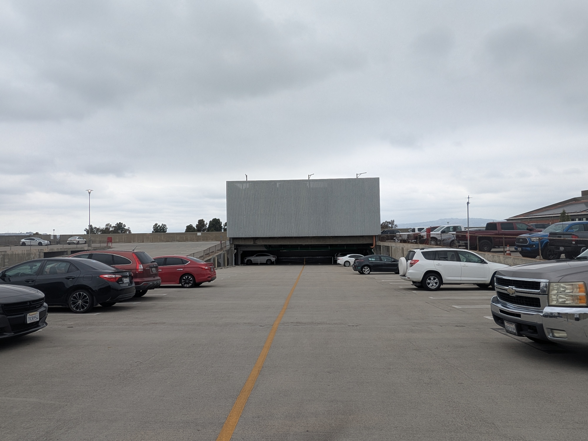
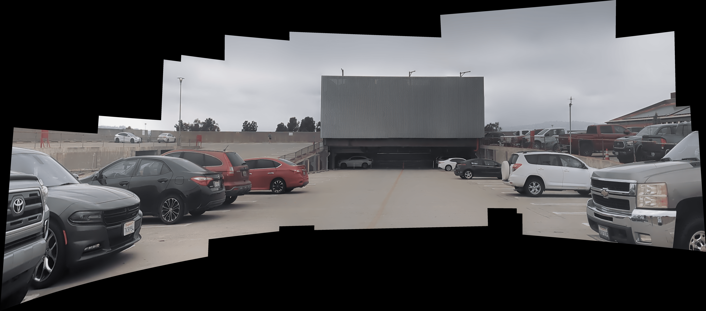
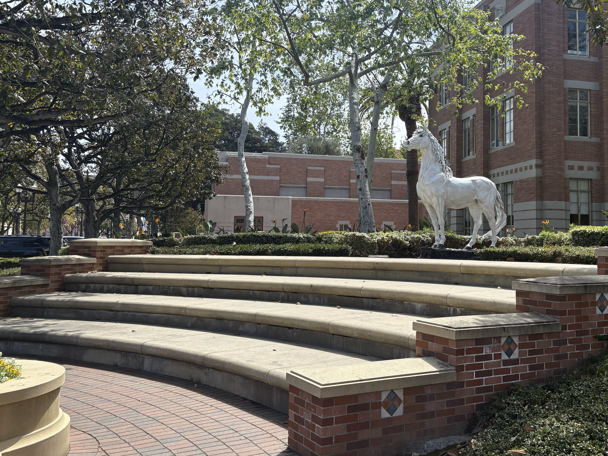

# Video Scene Stitcher - CSCI 576 Final Project

This program takes input videos and attempts to reconstruct the scene that the videos capture in a panorama-esque manner.

## Program Requirements

This program requires `Python 3` and `ffmpeg`.

All required python modules can be installed with `pip` using the `requirements.txt` file.

## Run Instructions

`python main.py <video path> [<stitch mode> <warper type>]`

`<stitch mode>` and `<warper type>` are optional params (if neither is input it runs the affine stitcher), but `<stitch mode>` must be included if there is a `<warper type>` input and it must come before.

The stitch modes are:
- `0` for `affine`
- `1` for default (`ray` adjuster) stitching
- `2` for `reprojection` adjuster stitching.

Default warper type is `spherical` if the `1` or `2` stitch modes are used.

For affine stitching, ORB was used as the feature extractor. For all other stitching, SIFT was used. To use different feature extraction algorithms, modify the value of the `'detector'` attribute of the `settings` variable in `imageStitch.py`.

To see all possible warper types and for more info on these terms, please consult the image stitching module's github pages at https://github.com/OpenStitching/stitching.

## Example Outputs
| Reference | Result |
| --- | --- |
|  |  |
|  |  |
|  |  |
|  |  |
